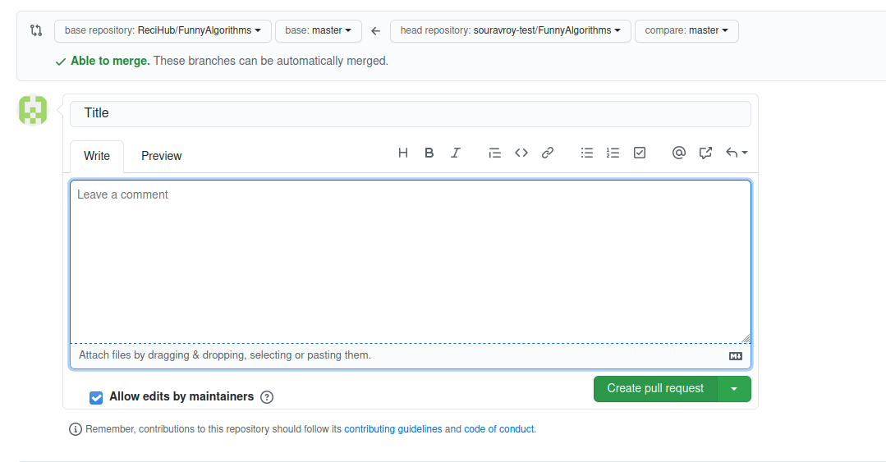
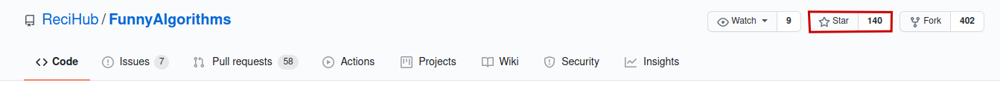

<!--  -->

   
    
   
   
   
   

## Funny Algorithms

_A repository with a bunch of funny algorithms, beginners friendly:sparkles:_

_Don't forget to read our [Contributing Guide](https://github.com/ReciHub/FunnyAlgorithms/blob/master/CONTRIBUTING.md) and our [Code of Conduct](https://github.com/ReciHub/FunnyAlgorithms/blob/master/CODE_OF_CONDUCT.md)_

## Algorithms are fun, right?

So why not add the funniest algorithms in this repository? We can share with all the world so people can have fun with us! 

You can contribute in two ways:

- Add a new algorithm inside a folder, name the folder with the type of the algorithm. Example: (Algorithm: bogoSort.c, folder: sort)
- Rewrite an existing algorithm in another programming language

It is always fun to check new algorithms or see how the same algorithms can be rewritten in different programming languages.

## Submit a pull request

After adding your funny algorithm, share it with us by making a [pull request](https://github.com/ReciHub/FunnyAlgorithms/blob/master/CONTRIBUTING.md#submitting-a-pull-request) so others can see how amazing your algorithm is.

   - To submit a pull request, write a `Title` , `Leave a Comment` and click the `Create Pull Request` button. That's all. 
   - Make sure you add a good description in what you are adding and that each algorithm has a commit.

## Enjoyed? 

Leave a :star: to the repository and share this with your friends!

