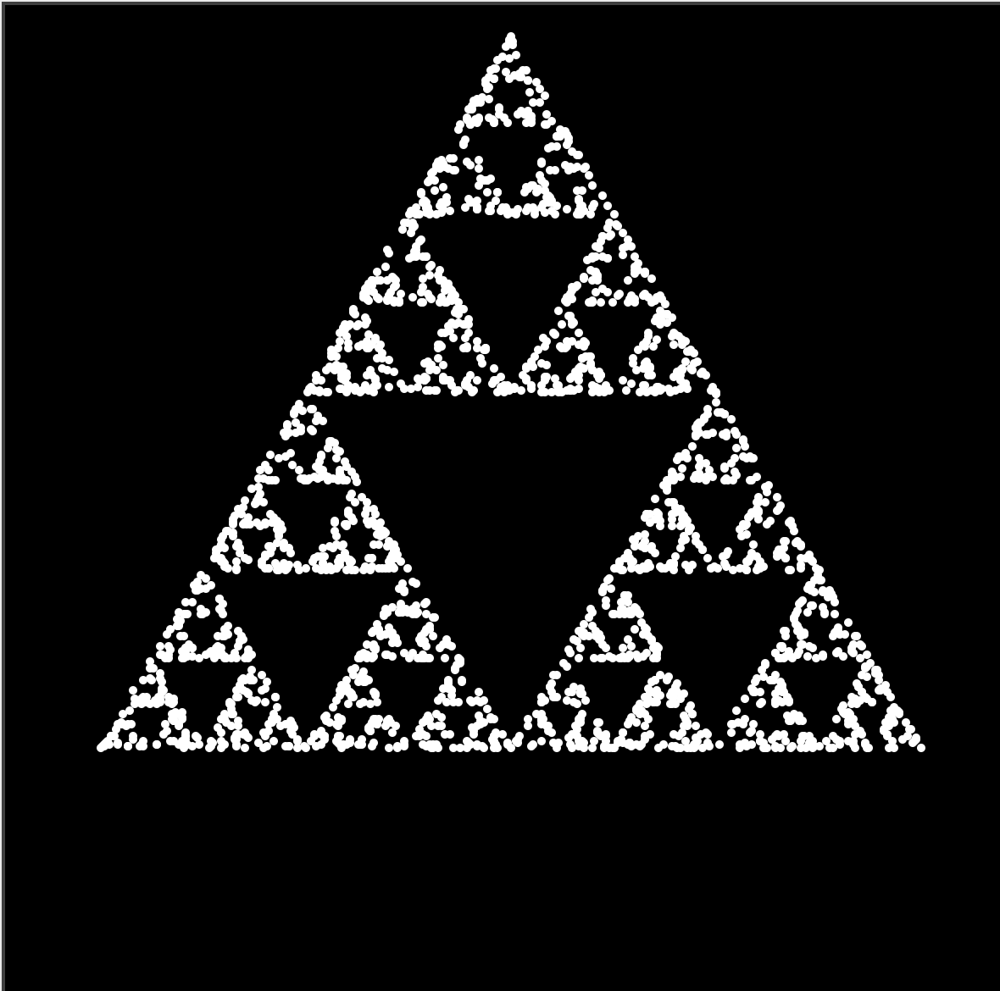

# Sierpiński Triangle Generator using Turtle Graphics

This Python script generates the Sierpiński Triangle fractal using the Turtle Graphics library. The Sierpiński Triangle is a classic example of a fractal pattern known for its self-replicating, intricate structure.



## How to Run

1. Ensure you have Python and the Turtle Graphics library installed in your environment.
2. Clone this repository or download the Python script to your computer.
3. Run the script using your preferred Python environment.

## About the Sierpiński Triangle

The Sierpiński Triangle is constructed by recursively removing smaller equilateral triangles from a larger equilateral triangle. This process is repeated infinitely, resulting in a self-replicating pattern.

## Customize the Triangle

You can customize various aspects of the generated Sierpiński Triangle:

- Depth of recursion to control the complexity of the pattern.
- Initial size of the triangle.
- Choose whether to display a rainbow-colored triangle or a white one.

## Example

```python
# Customize the depth of recursion and other parameters
depth = 3
initial_size = 400
rainbow = False  # Set to True for a rainbow-colored triangle

# Run the script to generate the Sierpiński Triangle
